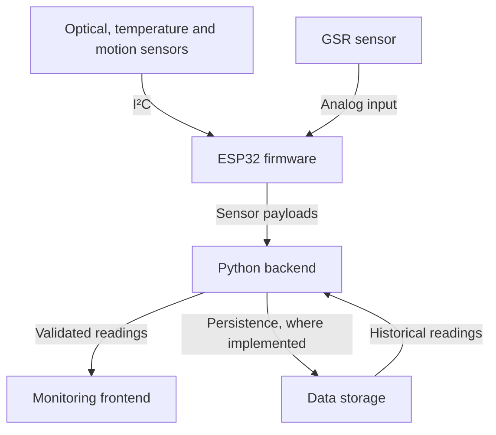

# Sanjeevni


### ESP32-based wearable sensing and wellness monitoring platform

**Sanjeevni connects wearable sensors to a Python backend and a live monitoring interface.** It brings optical pulse signals, temperature, motion, and galvanic skin response into one data pipeline, allowing engineers and researchers to observe measurements from a connected wearable.

The project combines embedded firmware, sensor integration, backend processing, and frontend visualization. Its central design requirement is simple: **every reading presented as live sensor data must originate from physical hardware.** Missing or invalid measurements must remain visibly unavailable.

> **Project scope:** Sanjeevni is a research and engineering platform, not a certified medical device. This README describes the supplied project design; repository-specific commands, deployed features, and performance results require confirmation against the implementation.

## Contents

| Explore | What you will find |
| --- | --- |
| [Purpose and capabilities](#purpose-and-capabilities) | Product purpose and intended functionality. |
| [System architecture](#system-architecture) | Sensor-to-dashboard flow and responsibilities. |
| [Hardware and measurements](#hardware-and-measurements) | Components, interfaces, and signal interpretation. |
| [Software components](#software-components) | Technology stack and repository structure. |
| [Data integrity and reliability](#data-integrity-and-reliability) | Rules for valid, missing, and stale measurements. |
| [Getting started](#getting-started) | Requirements, setup sequence, and configuration. |
| [Integration reference](#integration-reference) | Backend integration responsibilities. |
| [Validation and limitations](#validation-and-limitations) | Calibration and acceptance criteria. |
| [Roadmap](#roadmap) | Future development areas. |
| [Contributing](#contributing) · [License](#license) | Contribution guidance and licensing. |

## Purpose and capabilities

Wearable monitoring requires more than reading a sensor: measurements must travel reliably from the device to an application, retain their meaning, and clearly communicate whether they are valid and current.

Sanjeevni is designed to address that complete workflow through:

| Capability | Purpose |
| --- | --- |
| Multi-sensor acquisition | Collect optical, temperature, motion, and skin-response signals through one ESP32 controller. |
| Connected data pipeline | Transfer device readings to a backend for validation and processing. |
| Live visualization | Present incoming measurements and device status through a dashboard. |
| Modular software layers | Allow sensor drivers, processing logic, and interface components to evolve independently. |
| Explicit data quality states | Distinguish valid readings from missing, invalid, disconnected, or stale data. |

Historical views depend on the implemented storage and retrieval features. Derived metrics such as heart rate and SpO₂ depend on the available processing algorithms and signal quality; the sensor list alone does not establish validated measurement accuracy.

## System architecture



The ESP32 initializes the sensors, acquires readings, and packages them for transmission. The backend receives those payloads, validates their structure and values, applies supported processing, and makes the results available to the frontend. Storage supports historical retrieval where implemented.

Wi-Fi is the intended connected transport, with serial communication available for development or debugging as supported by the firmware. The exact device protocol and frontend update mechanism—polling, WebSocket, or server-sent events—must match the implementation.

“Live” describes updates as readings arrive; no measured end-to-end latency or guaranteed update rate is specified in the supplied documentation.

## Hardware and measurements

| Component | Interface | Signal or measurement | Interpretation |
| --- | --- | --- | --- |
| **ESP32** | I²C, ADC, connectivity | Sensor acquisition and transmission | Coordinates the wearable data pipeline. |
| **MAX30102** | I²C | Optical photoplethysmography (PPG) signals | Input to heart-rate and SpO₂ estimation algorithms; derived values require suitable signal quality and validation. |
| **MPU6050** | I²C | Three-axis acceleration and three-axis angular velocity | Provides motion data for activity and orientation-related analysis. |
| **MAX30205** | I²C | Temperature at the sensor | Must not automatically be interpreted as core body temperature. |
| **GSR module** | Analog ADC | Skin-response signal | Raw ADC readings require the module’s conversion and calibration details before being reported as physical conductance or resistance. |

GSR provides a physiological signal for exploratory analysis; it does not directly diagnose stress or a psychological condition.

Pin assignments, module supply requirements, I²C configuration, and the GSR analog input must follow the actual board and firmware configuration. A verified wiring diagram and bill of materials are needed for a reproducible hardware build; neither is established by the supplied README.

## Software components

| Component | Documented technology | Responsibility |
| --- | --- | --- |
| Firmware | ESP32-compatible C/C++; Arduino IDE or PlatformIO | Sensor initialization, acquisition, payload generation, connectivity, and device error reporting. |
| Backend | Python | Payload validation, supported signal processing, persistence, and API access. |
| Frontend | JavaScript/TypeScript application; framework unspecified | Live measurements, per-sensor visualization, connection state, and supported historical views. |
| Storage | Implementation unspecified | Retention and retrieval of measurements, where available. |

### Repository organization

The source documentation describes the following **expected layout**. Confirm these paths against the repository before using them.

```text
Sanjeevni/
├── firmware/                 # Device acquisition and communication
│   └── ESP32/                # ESP32 firmware and sensor modules
├── backend/                  # Python service and data processing
│   └── README.md             # Backend setup and API reference
├── frontend/                 # Monitoring interface and visualizations
├── docs/                     # Architecture, wiring and calibration
└── README.md                 # Project overview and integration guide
```

| Path | Expected contents |
| --- | --- |
| `firmware/` | ESP32 firmware, sensor drivers, and hardware configuration. |
| `backend/` | Python service, dependencies, configuration, and backend documentation. |
| `frontend/` | Dashboard source, package manifest, and application configuration. |
| `docs/` | Architecture notes, wiring information, calibration records, and research material. |

The source references `backend/README.md` for service-specific setup and API details. That file was not included with the supplied material.

## Data integrity and reliability

**Live measurements must be traceable to real sensor acquisition.** Random values, hard-coded physiological values, and fabricated fallback readings must never appear as live measurements.

Expected behavior across the system:

| Condition | Required behavior |
| --- | --- |
| Sensor unavailable or read failure | Report the affected sensor as unavailable; do not substitute a plausible value. |
| Malformed or invalid payload | Return an explicit validation error and prevent invalid data from being presented as valid. |
| Network interruption | Report connectivity loss and use the implemented reconnection behavior. |
| No recent reading | Mark the measurement as stale or disconnected; do not present an old reading as current. |
| Derived metric unavailable | Keep the metric unavailable until the algorithm has sufficient valid input. |
| Software test fixture | Clearly label and isolate test data from the live measurement pipeline. |

The firmware, backend, and frontend should preserve these states consistently. A missing reading is not the same as a measured zero.

## Getting started

### Prerequisites

| Requirement | Details |
| --- | --- |
| Hardware | ESP32 and MAX30102, MPU6050, MAX30205, and GSR modules. |
| Assembly | Verified wiring, suitable power supply, and USB flashing connection. |
| Firmware tools | Arduino IDE or PlatformIO, matching the firmware project. |
| Backend runtime | Python 3.10+ as specified in the source documentation; confirm dependencies. |
| Frontend runtime | Node.js and the package manager required by the project manifest. |
| Development access | Git and network connectivity between the device and backend. |

### Setup sequence

| Step | Action | Completion check |
| --- | --- | --- |
| 01 | Obtain the actual repository and review its module documentation. | Dependency manifests and entry points identified. |
| 02 | Create a Python environment, install declared dependencies, configure and start the backend. | Service starts with the intended configuration. |
| 03 | Install frontend dependencies, set its backend URL, and run its declared development script. | Dashboard opens and can reach the backend. |
| 04 | Verify hardware wiring and power, then initialize each sensor. | Device logs show successful acquisition. |
| 05 | Set the ESP32 board, network credentials, and ingestion endpoint; flash the intended firmware. | Wearable connects and transmits readings. |
| 06 | Follow a measurement from the device through ingestion to the dashboard. | Fresh hardware readings appear in the interface. |

The ESP32 must use a backend address reachable from its network. A `localhost` address on the ESP32 refers to the device itself, not the development computer.

### Configuration reference

Exact variable names must come from the repository’s configuration files. The following are configuration categories, not a verified `.env` schema.

| Component | Configuration to confirm |
| --- | --- |
| Firmware | Wi-Fi credentials, backend address, sensor pin assignments, acquisition interval, and transmission interval. |
| Backend | Bind address, service port, storage connection, logging, and permitted frontend origins where applicable. |
| Frontend | Backend base URL and live-update configuration. |

Keep credentials out of committed source files. Example configuration files should contain placeholders only.

## Integration reference

The backend design includes four integration responsibilities:

| Operation | Intended use |
| --- | --- |
| Ingest measurements | Receive sensor payloads from the wearable. |
| Retrieve latest measurements | Supply the dashboard with the most recent valid readings. |
| Retrieve history | Return stored readings where historical access is implemented. |
| Retrieve device status | Expose device connectivity and measurement availability. |

The supplied draft included illustrative routes, but did not establish an executable API contract. Confirm endpoint paths, request schemas, units, timestamps, authentication, and error responses in the backend before integrating a client. Streaming support also needs implementation confirmation.

## Validation and limitations

### Sensor validation

| Sensor | Validation focus |
| --- | --- |
| MAX30102 | Placement, contact quality, movement, ambient light, and validation of the derived-metric algorithm. |
| MPU6050 | Stationary offset calibration and consistency of axis orientation and units. |
| MAX30205 | Comparison with a reference thermometer under controlled, documented conditions. |
| GSR | Electrode contact, baseline variation, ADC configuration, and the module’s conversion method. |

### End-to-end acceptance checks

| Check | Expected result |
| --- | --- |
| Measurement origin | Every live value originates from connected hardware. |
| Sensor removal | The affected measurement becomes explicitly unavailable. |
| Network loss | The interface shows disconnected or stale status. |
| Invalid payload | The backend returns a clear validation error. |
| Pipeline trace | A known hardware reading can be followed through ingestion to display. |
| Historical retrieval | Stored values and timestamps remain consistent, where supported. |

These are acceptance criteria, not a report of completed tests. The supplied material provides no measured accuracy, latency, battery-life, uptime, or load-test results.

Signal quality depends on sensor placement, contact, calibration, movement, and environmental conditions. Network availability also affects live visibility. Sanjeevni is intended for engineering evaluation and wellness exploration, not diagnosis, treatment, or emergency monitoring.

## Roadmap

The source documentation identifies these future directions; they are not presented as completed capabilities:

| Development area | Planned direction |
| --- | --- |
| Sensing | Additional physiological inputs, including ECG and respiration. |
| Edge processing | Expanded on-device filtering and signal processing. |
| Data platform | Cloud-based long-term storage and analytics. |
| User experience | Mobile companion application. |
| Notifications | Alerts for anomalous readings. |
| Power | Battery-life and power-management improvements. |

## Contributing

Create a focused feature branch and keep changes within the relevant firmware, backend, frontend, or documentation layer. Explain the problem, the resulting behavior, and how the change was validated in the pull request.

Sensor-related changes should include real-hardware validation where possible. Record the board and sensor configuration, calibration conditions, and any known limitations. Keep setup instructions and API documentation aligned with implementation changes, and preserve the data-integrity requirements above.

## License

Confirm the license in the repository’s `LICENSE` file before using or redistributing the project. A specific license is not established in the supplied documentation.
